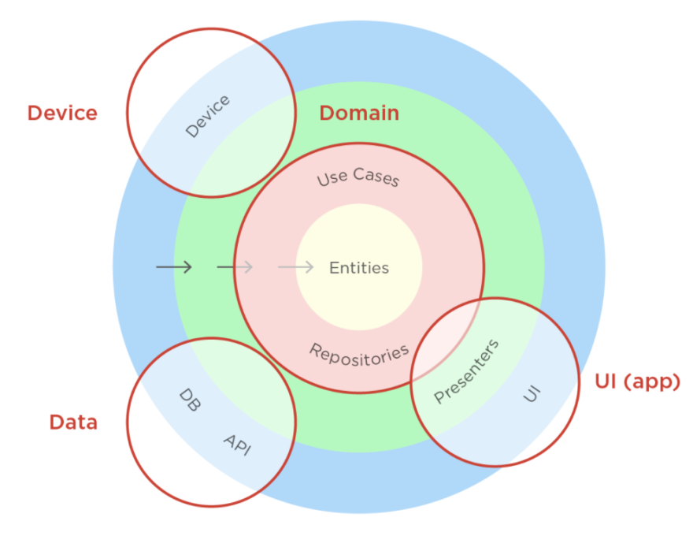

# Flutter 2.5.3

# clean_architecture

A new Flutter project, with clean architecture, using GetX

## Getting Started

This project is my template (18-12-2021) to start new projects, @BinniZenobioCordovaLeandro.



### Tree

- UI: Layer in charge of representing data on a device or platform. In our case, it will be all the Flutter code corresponding to our Widgets, pages, navigation ...

- Data: Layer in charge of communicating with the external dependencies that our app needs to obtain the data. For example, the concrete implementation of the repositories with HTTP calls , Firebase ...

- Device: Layer in charge of accessing the native functionalities of the device on which our app will run. For example, access to biometrics, use of GPS ...

- Domain: Layer that encompasses all the business logic of our app, where the code that must be agnostic of any other part of our software is located. In this case, it is pure Dart code.

- Interface: To carry out this communication between the layers we will use the interfaces.

## References:

Principal:
- [Robert_C._Martin, Books](https://en.wikipedia.org/wiki/Robert_C._Martin)

Secondary:
- [DartConf 2018, Flutter / AngularDart – Code sharing, better together](https://www.youtube.com/watch?v=PLHln7wHgPE&t=1379s)

- [Clean architecture, Flutter structure](https://www.youtube.com/watch?v=iiXAoP9ZRUs)

- [Medium, flutter structure](https://alfredobs97.medium.com/clean-architecture-en-flutter-ee028a6379a5)

- [Clean architecture and hexagonal architecture, scalar and maintenance](https://www.youtube.com/watch?v=y3MWfPDmVqo)

Extras books:

- [Clean architecture](https://blog.cleancoder.com/uncle-bob/2012/08/13/the-clean-architecture.html)

- [Onion architecture](https://jeffreypalermo.com/2008/07/the-onion-architecture-part-1/)

- [Hexagonal architecture](https://alfredobs97.medium.com/clean-architecture-en-flutter-ee028a6379a5#:~:text=Hexagonal%20Architecture)


## How run Unit test ?

With Mockito, run unit test with:

```
    fvm flutter test test
```

## How run Widgets test ?
To do implement.

## How run Integration test ?

First start an emulator/simulator or real device, (if you need the camera, for example, need start the application on a real device)

after, run into command line

```
    flutter test integration_test
```

References: `https://youtu.be/WPEsnJgW99M`